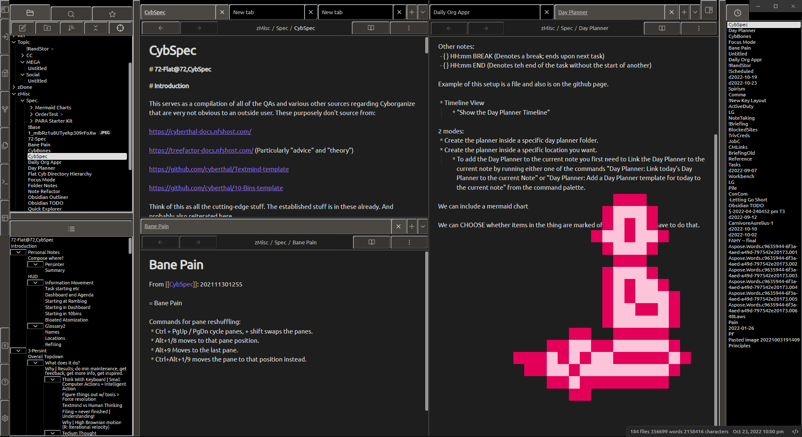

Micro Mike is a high-density retro-style interface with a focus on mouse & eye ergonomics. Try it out and see if you like any of the changes I've made. Only dark mode is supported.

Style Settings is recommended for further configurability. 

Features:
* Zoomed out, high-density file browser & outline view
* Blender-styled right-click dropdown menu.
* Further modified Quick Explorer dropdowns
* Left-aligned readable line length for eye movement convenience. Size can be configured in settings.
* Consistent line size.
* Sidebar button panel scales with sidebar width.
* Larger sidebar resize bars (configurable).
* Button boundaries are clearly defined.
* You can click buttons on the edge of the window when fullscreen (with some exceptions).
* Scroll-free options (unless you have > 25ish plugins).

It natively supports:
* All internal plugins
* Community
	* AidenLx's Folder Note
	* Quick Explorer
	* Recent Files
	* QuickAdd

If you would like support added for another plugin, feel free to file an issue. 

This theme is derived from:
* https://github.com/SMUsamaShah/Obsidian-Win98-Edition
* https://github.com/zcysxy/Obsidian-Terminal-Theme
* https://github.com/chetachiezikeuzor/Yin-and-Yang-Theme
* https://github.com/Dmytro-Shulha/obsidian-css-snippets

